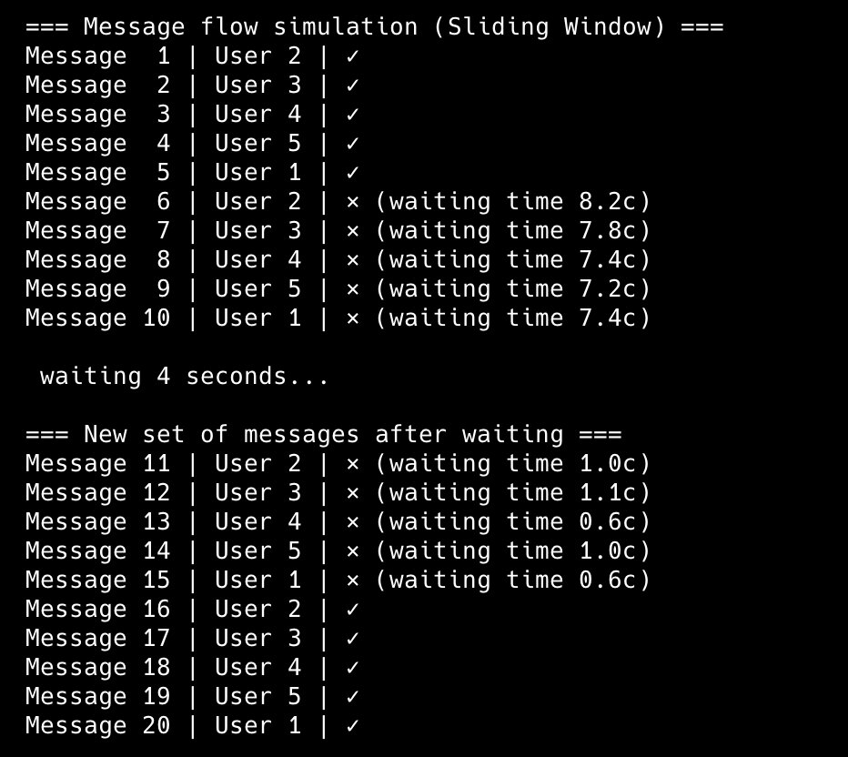
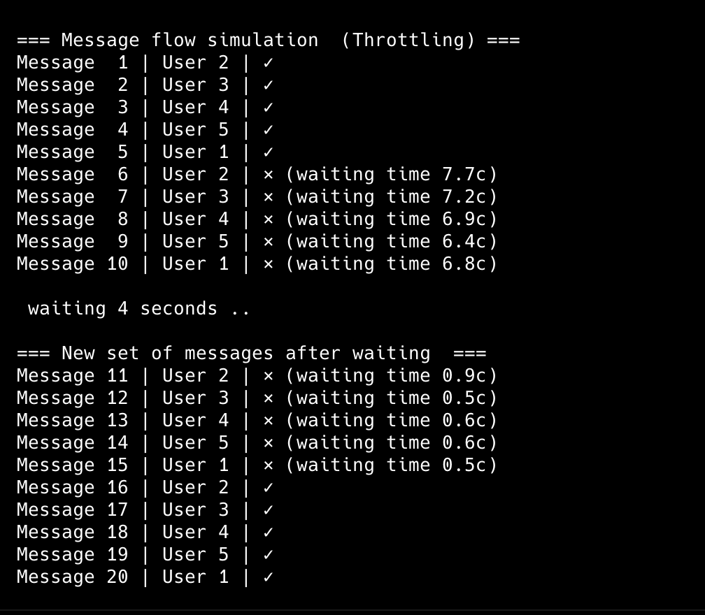

# goit-algo2-hw-08
Design and Analysis of Algorithms: Implemented flow control and rate-limiting mechanisms to prevent spam in a chat system. Utilized the Sliding Window algorithm and Throttling methods to ensure efficient message regulation and maintain system integrity.

Both tasks implement messages flow control and insures that one user can send only one message within 10 seconds interval.

# Task 1

Flow control using Sliding window method.

# Task 2

Flow control using Throttling method.

